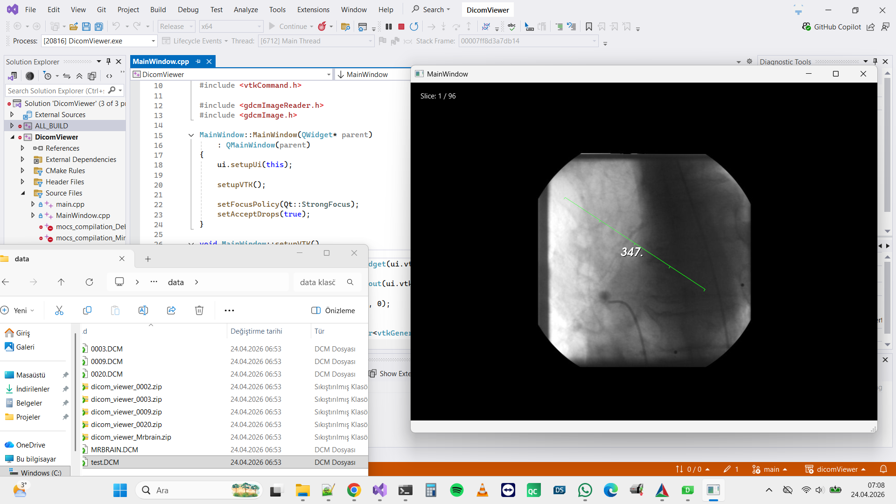

# DICOM Viewer (Qt + VTK + GDCM)

Simple desktop DICOM viewer implemented in C++ using Qt, VTK and GDCM.

## Features

- Drag & drop DICOM loading
- Multi-slice navigation (Up / Down keys)
- Distance measurement tool
- Basic image rendering with VTK

## Requirements

- Qt 6 (MSVC)
- VTK (built and installed)
- GDCM (built and installed)
- CMake

## Build

```bash
cmake -S . -B build -DCMAKE_PREFIX_PATH="<Qt_DIR>;<VTK_DIR>;<GDCM_DIR>"
cmake --build build --config Release

Example:

cmake -S . -B build -DCMAKE_PREFIX_PATH="C:/Qt/6.x.x/msvc2022_64;C:/libs/vtk/install;C:/libs/gdcm/install"

Replace the paths with your own installations.

Usage
Run the application
Drag and drop a .dcm file into the window
Use Up / Down arrow keys to navigate slices
Click twice on the image to measure distance
Notes
Built and tested on Windows (MSVC, x64)
Dependencies must use the same compiler and architecture
Currently optimized for basic DICOM datasets (e.g. 8-bit images)
Limitations
Advanced DICOM features (window/level, palette color, etc.) are not fully handled
Limited format coverage depending on dataset
Tech Stack
Qt (UI)
VTK (rendering)
GDCM (DICOM parsing)

## Screenshot


